# IIoT Predictive Maintenance - Architecture Diagrams

This document contains Mermaid diagrams for the IIoT Predictive Maintenance Platform. GitHub renders these automatically. For other tools, use a Mermaid-compatible viewer or the standalone `.mmd` files in the `diagrams/` folder.

---

## Reference Architecture

```mermaid
%%{init: {'theme': 'base', 'themeVariables': { 'primaryColor': '#29B5E8', 'primaryTextColor': '#fff', 'primaryBorderColor': '#1a8ab8', 'lineColor': '#6E7781', 'secondaryColor': '#11567F', 'tertiaryColor': '#F4F4F4', 'background': '#ffffff'}}}%%

flowchart TB
    subgraph FLOOR["🏭 MANUFACTURING FLOOR"]
        direction TB
        SENSORS["PLCs / RTUs / Sensors<br/><i>Temperature, Vibration, Pressure, Current</i>"]
        HIVEMQ["<b>HiveMQ MQTT Broker</b><br/>QoS 1/2 • TLS • Clustered HA"]
        ASSETS["<b>Asset Types</b><br/>Furnaces • Conveyors • Presses<br/>Robots • Compressors • HVAC"]
        
        SENSORS --> HIVEMQ
        ASSETS -.-> SENSORS
    end

    subgraph SNOWFLAKE["❄️ SNOWFLAKE DATA CLOUD"]
        direction TB
        
        subgraph INGEST["INGESTION LAYER"]
            SNOWPIPE["Snowpipe Streaming<br/><i>Sub-second latency</i>"]
            RAW["TELEMETRY_RAW<br/><i>Landing Zone</i>"]
            SNOWPIPE --> RAW
        end

        subgraph BRONZE["🥉 BRONZE LAYER"]
            TELBRONZE["TELEMETRY_BRONZE<br/>Raw sensor readings<br/>Device metadata<br/>Event & ingest timestamps"]
        end

        subgraph SILVER["🥈 SILVER LAYER"]
            TELSILVER["TELEMETRY_SILVER<br/>Cleansed & validated<br/>Enriched with context<br/>Standardized formats"]
            REGISTRY["ASSET_REGISTRY<br/>Equipment hierarchy<br/>Maintenance history<br/>Criticality levels"]
        end

        subgraph GOLD["🥇 GOLD LAYER"]
            FEATURES["ENTERPRISE_C_FEATURES<br/>Rolling aggregations<br/>Statistical features<br/>Cross-sensor correlations"]
        end

        subgraph ML["🧠 SNOWPARK ML"]
            TRAINING["Model Training<br/>XGBoost • RF • DL"]
            REGISTRY_ML["Model Registry"]
            INFERENCE["Inference Engine"]
            
            TRAINING --> REGISTRY_ML
            REGISTRY_ML --> INFERENCE
        end

        subgraph PREDICTIONS["🎯 PREDICTIONS"]
            PRED_TABLE["ASSET_PREDICTIONS<br/>Failure probabilities<br/>RUL estimates<br/>SHAP values"]
            RULES["PREDICTIVE_RULES<br/>Alert thresholds<br/>Work order templates"]
        end

        subgraph CORTEX["🤖 CORTEX AI"]
            SEMANTIC["Semantic View<br/>PREDICTIVE_MAINTENANCE"]
            ANALYST["Cortex Analyst<br/>NLQ Interface"]
            COMPLETE["Cortex Complete<br/>5-Why Analysis"]
            
            SEMANTIC --> ANALYST
            ANALYST --> COMPLETE
        end

        RAW --> TELBRONZE
        TELBRONZE --> TELSILVER
        REGISTRY -.-> TELSILVER
        TELSILVER --> FEATURES
        FEATURES --> TRAINING
        INFERENCE --> PRED_TABLE
        PRED_TABLE --> RULES
        PRED_TABLE --> SEMANTIC
    end

    subgraph SPCS["📦 SNOWPARK CONTAINER SERVICES"]
        direction TB
        subgraph APP["APPLICATION"]
            REACT["React Frontend<br/>Dashboards • NLQ Chat<br/>5-Why Dialog"]
            FASTAPI["FastAPI Backend<br/>REST APIs<br/>Cortex Integration"]
            NGINX["NGINX"]
            
            REACT <--> FASTAPI
            NGINX --> REACT
            NGINX --> FASTAPI
        end
        ENDPOINT["🌐 Public Endpoint<br/>SSL/TLS"]
        NGINX --> ENDPOINT
    end

    subgraph USERS["👥 END USERS"]
        direction LR
        TECH["👷 Technicians"]
        OPS["📊 Managers"]
        REL["⚙️ Engineers"]
        EXEC["📈 Leadership"]
    end

    HIVEMQ ==>|"MQTT/TLS"| SNOWPIPE
    CORTEX --> FASTAPI
    PRED_TABLE --> FASTAPI
    ENDPOINT --> USERS
```

---

## Data Flow (Horizontal)

```mermaid
%%{init: {'theme': 'base', 'themeVariables': { 'primaryColor': '#29B5E8'}}}%%

flowchart LR
    subgraph S1["1️⃣ CAPTURE"]
        A1["🔧 Sensors<br/>Capture readings"]
    end

    subgraph S2["2️⃣ AGGREGATE"]
        A2["📡 HiveMQ<br/>MQTT broker"]
    end

    subgraph S3["3️⃣ INGEST"]
        A3["⚡ Snowpipe<br/>Streaming"]
    end

    subgraph S4["4️⃣ PRESERVE"]
        A4["🥉 Bronze<br/>Raw data"]
    end

    subgraph S5["5️⃣ CURATE"]
        A5["🥈 Silver<br/>Cleansed"]
    end

    subgraph S6["6️⃣ ENGINEER"]
        A6["🥇 Gold<br/>Features"]
    end

    A1 --> A2 --> A3 --> A4 --> A5 --> A6

    subgraph S7["7️⃣ TRAIN"]
        A7["🧠 Snowpark<br/>ML models"]
    end

    subgraph S8["8️⃣ SCORE"]
        A8["📊 Inference<br/>Predictions"]
    end

    subgraph S9["9️⃣ PREDICT"]
        A9["🎯 Results<br/>Probabilities"]
    end

    subgraph S10["🔟 CONVERSE"]
        A10["💬 Cortex<br/>NLQ/5-Why"]
    end

    subgraph S11["1️⃣1️⃣ PRESENT"]
        A11["🖥️ App<br/>React UI"]
    end

    subgraph S12["1️⃣2️⃣ ACT"]
        A12["👷 Users<br/>Take action"]
    end

    A6 --> A7 --> A8 --> A9 --> A10 --> A11 --> A12
```

---

## Data Flow (Vertical - Presentation Ready)

```mermaid
%%{init: {'theme': 'base', 'themeVariables': { 'primaryColor': '#29B5E8', 'primaryTextColor': '#fff', 'lineColor': '#6E7781'}}}%%

flowchart TB
    subgraph EDGE["🏭 EDGE / MANUFACTURING FLOOR"]
        direction LR
        PLC["PLCs & RTUs"]
        SENSOR["IoT Sensors"]
        GATEWAY["Edge Gateways"]
        PLC --- SENSOR --- GATEWAY
    end

    subgraph MQTT["📡 MESSAGE BROKER"]
        HIVEMQ["<b>HiveMQ MQTT Broker</b><br/>Pub/Sub • QoS • TLS • Clustering"]
    end

    subgraph LANDING["⬇️ DATA LANDING"]
        SNOWPIPE["<b>Snowpipe Streaming</b><br/>Serverless • Auto-scale • Sub-second"]
    end

    subgraph MEDALLION["❄️ MEDALLION ARCHITECTURE"]
        direction TB
        
        subgraph B["🥉 BRONZE"]
            BRONZE["TELEMETRY_BRONZE<br/>Raw • Immutable • Audit Trail"]
        end
        
        subgraph S["🥈 SILVER"]
            SILVER["TELEMETRY_SILVER<br/>Cleansed • Validated • Enriched"]
            ASSETSS["ASSET_REGISTRY<br/>Master Data • Hierarchy"]
        end
        
        subgraph G["🥇 GOLD"]
            FEATURES["ENTERPRISE_C_FEATURES<br/>Feature Store • ML-Ready"]
        end
        
        BRONZE --> SILVER
        ASSETSS -.->|enrich| SILVER
        SILVER --> FEATURES
    end

    subgraph MLOPS["🧠 ML OPERATIONS"]
        direction LR
        TRAIN["Model Training<br/>Snowpark ML"]
        REG["Model Registry<br/>Versions"]
        INFER["Inference<br/>Scoring"]
        TRAIN --> REG --> INFER
    end

    subgraph OUTPUTS["🎯 PREDICTIONS & INTELLIGENCE"]
        direction LR
        PREDS["ASSET_PREDICTIONS<br/>Failure Probability • RUL"]
        RULES["PREDICTIVE_RULES<br/>Thresholds • Alerts"]
        PREDS --- RULES
    end

    subgraph AI["🤖 CORTEX AI SERVICES"]
        direction LR
        SEMANTIC["Semantic View"]
        ANALYST["Cortex Analyst<br/>NLQ"]
        LLM["Cortex Complete<br/>5-Why"]
        SEMANTIC --> ANALYST --> LLM
    end

    subgraph APPLICATION["🖥️ APPLICATION - SPCS"]
        direction LR
        BACKEND["FastAPI<br/>REST APIs"]
        FRONTEND["React<br/>Dashboards"]
        BACKEND <--> FRONTEND
    end

    subgraph USERS["👥 END USERS"]
        direction LR
        MAINT["👷 Technicians"]
        OPS["📊 Operators"]
        ENGR["⚙️ Engineers"]
        EXEC["📈 Executives"]
    end

    EDGE ==>|"MQTT/TLS"| MQTT
    MQTT ==>|"Streaming"| LANDING
    LANDING ==> MEDALLION
    FEATURES ==> MLOPS
    INFER ==> OUTPUTS
    OUTPUTS ==> AI
    OUTPUTS ==> APPLICATION
    AI ==> APPLICATION
    APPLICATION ==>|"HTTPS"| USERS
```

---

## Snowflake Services Map

---

## Component Interaction Sequence

```mermaid
%%{init: {'theme': 'base'}}%%

sequenceDiagram
    participant S as Sensor
    participant M as MQTT Broker
    participant SP as Snowpipe
    participant SF as Snowflake
    participant ML as Snowpark ML
    participant CA as Cortex Analyst
    participant App as SPCS App
    participant U as User

    S->>M: Publish telemetry (MQTT)
    M->>SP: Stream messages
    SP->>SF: Ingest to Bronze
    
    Note over SF: Data Pipeline
    SF->>SF: Bronze → Silver (cleanse)
    SF->>SF: Silver → Gold (features)
    
    Note over ML: ML Pipeline
    SF->>ML: Feature data
    ML->>SF: Store predictions
    
    U->>App: Open dashboard
    App->>SF: Query predictions
    SF->>App: Return active alerts
    App->>U: Display predictions
    
    U->>App: Ask "Why is Furnace failing?"
    App->>CA: NLQ query
    CA->>SF: Generate & execute SQL
    SF->>CA: Return data
    CA->>App: 5-Why analysis
    App->>U: Display root cause
    
    U->>App: Create service order
    App->>SF: Log action
```

---

## Files in this Package

| File | Description |
|------|-------------|
| `REFERENCE_ARCHITECTURE.md` | Full documentation with ASCII diagrams |
| `DIAGRAMS.md` | This file - Mermaid diagrams for GitHub |
| `diagrams/reference-architecture.mmd` | Standalone Mermaid reference architecture |
| `diagrams/data-flow.mmd` | Standalone Mermaid horizontal data flow |
| `diagrams/data-flow-vertical.mmd` | Standalone Mermaid vertical data flow |

---

*Diagrams render automatically on GitHub. For local viewing, use VS Code with Mermaid extension, or paste into [mermaid.live](https://mermaid.live)*
